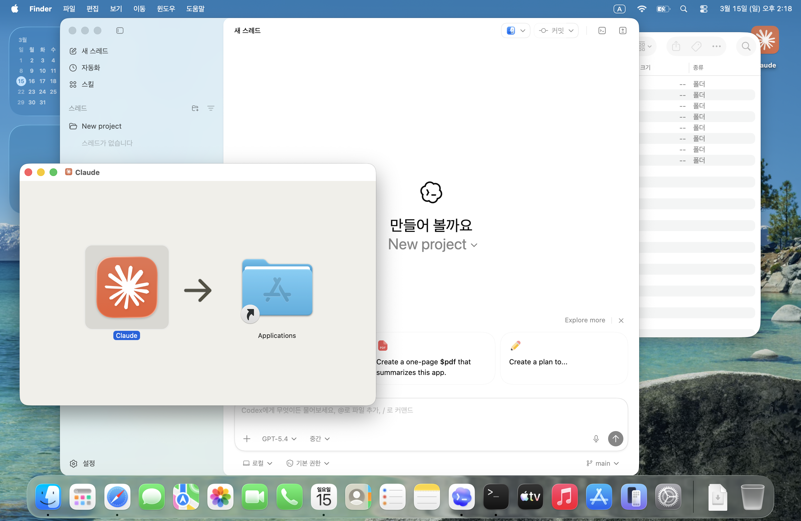

+++
title = '맥북 에어 M5 개봉기 — 첫 설치는 Claude와 Codex'
date = '2026-03-15T10:00:00+09:00'
draft = false
tags = ['MacBook', 'Claude', 'Codex', 'AI', 'LLM', '개발환경']
categories = ['Dev']
description = '새 맥북 에어 M5를 열자마자 제일 먼저 한 일 — AI 도구부터 설치했다.'

[[resources]]
  name = 'featured-image'
  src = 'claude-install.png'

[[resources]]
  name = 'featured-image-preview'
  src = 'claude-install.png'
+++

## 새 맥북이 왔다

맥북에어 M1 을 정말 잘 사용 했습니다. 
지금도 여러 개발을 직접 하는 현역이긴 한데, 메모리 부족으로 작업이 끊기는 일이 많아져서
더이상은 안되겠다는 생각이 들더라구요.

그래서, M5 맥북에어를 들였습니다.

---

## 제일 먼저 한 일은 AI 설치

M5 맥북에어를 받고 제일 처음 한 일은 Claude Code, Codex 를 설치한 일이었어요.

개발 하니까 CLI도 당연히 같이.

Claude Code, Codex 를 설치하고 나니,
나머지 설정들이 너무 편했습니다.
예전 같으면 적어 놓은 메모 보고 하나씩 설정 하던 것도,
이제는 딸깍이면 되니까요.

---

## 부쩍 달라진 세상

맥북을 열고 정말 제일 처음 생각난게 그거였습니다.
'Claude Code, Codex 설치'

세상이 변했다는게 느껴졌어요.

ChatGPT 를 처음 나왔을 때, API를 만지면서 미친 사람처럼 빠졌었는데,
그 당시에는 흥분해서 이야기 해도 시쿤둥한 사람이 대부분이었죠.

그러던게 작년 부터 갑자기 모든 사람들이 AI를 이야기 하기 시작 하더니,
지금은 카페에 앉아 있어도 지하철을 타고 있어도,
AI 이야기가 주변에서 들려 옵니다.

오히려 지금은 너무 많은 사람들이 이야기 하고 있어서,
정말 중요한 내용이 뭔지 파악하는게 더 힘들 정도인 것 같아요.

---

## 앞으로

이미 너무 많은 사람들이 AI를 이야기하고 있는데, 여기에 또 하나를 보태는 게 맞나 싶기도 합니다.
그래도 직접 써보고, 만들어 보면서 느낀 것들은 좀 다르지 않을까 싶어서 — 여기에 조금씩 남겨 보려 합니다.
특히 EDA 분야에서는요.

