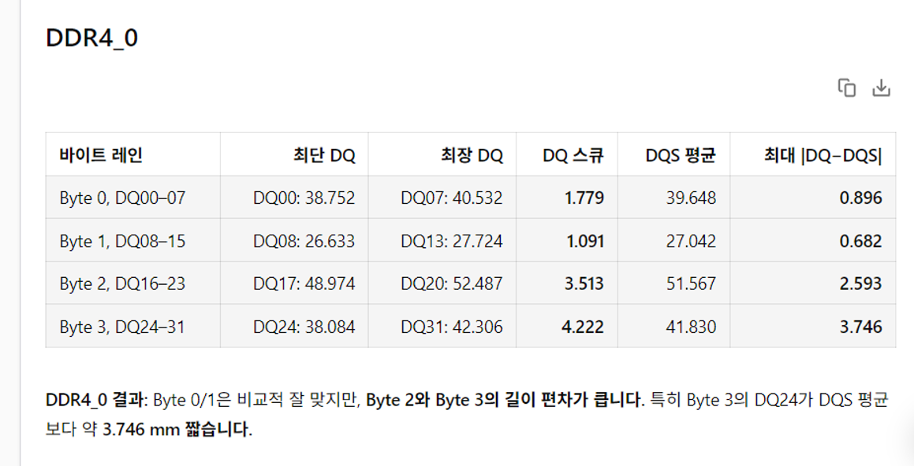

+++
title = 'gpt-5.6-sol로 DDR DQ Skew를 계산해 봤습니다'
date = '2026-07-11T10:00:00+09:00'
draft = false
tags = ['DDR', 'DQ', 'DQS', 'PCB', 'EDA', 'AI', 'LLM', 'Agent Harness']
categories = ['AI']
description = 'gpt-5.6-sol로 DDR DQ skew를 계산했을 때 DQS 상대 편차까지 함께 확인한 경험'

[[resources]]
  name = 'featured-image'
  src = 'featured-image.png'

[[resources]]
  name = 'featured-image-preview'
  src = 'featured-image.png'
+++

## 들어가며

cubic-ai-chat에서 `gpt-5.6-sol`을 사용하다가 정말 가볍게 물어봤어요.

> DDR DQ 라인 Skew를 구해 볼까?

DQ끼리의 길이 차이만 계산할 줄 알았는데, 모델은 DQS도 같이 봤습니다. DQS P/N 평균을 기준으로 DQ와의 편차까지 확인했어요.

## DQ와 DQS를 함께 봤습니다

계산값은 cubic-ai-chat에 연결된 도구가 원본 설계 데이터를 읽어 계산한 결과예요. 실제 프로젝트에서 pass인지 fail인지는 프로젝트 기준으로 판단하면 되고요.

---

## 결국 모델이 중요합니다

제가 반가웠던 건 숫자보다, DQ skew라는 짧은 요청에서 DQS 관계까지 먼저 챙겼다는 점이에요. 제가 써 본 OpenAI 계열 모델에서는 이런 반응이 처음인 것 같았습니다. 모델이 engineering intent를 전보다 조금 더 세심하게 보는 느낌이었어요.

Harness는 여전히 중요합니다. 도구를 연결하고 결과를 검증하는 역할은 그대로 필요하죠. 다만 Harness가 많이 강조되지만, 결국 중요한 건 모델 자체인 것 같아요. 로컬 서빙 모델에서 프론티어 모델 수준의 성능까지 기대하는 경우도 있는데, 현실적으로는 어렵습니다.

암튼 이번 답변은 꽤 마음에 들었어요.
