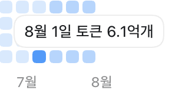

+++
title = '하루 6.1억 토큰, 해리 포터 전집 422번'
date = '2026-08-02T10:00:00+09:00'
draft = false
tags = ['Codex', 'AI Agent', 'Token', 'Automation', 'Productivity']
categories = ['AI', 'Automation']
description = '하루 동안 Codex가 처리한 6.1억 토큰을 해리 포터 전집과 비교하며, 토큰 사용량과 실제 결과의 관계를 돌아봤습니다.'

[[resources]]
  name = 'featured-image'
  src = 'featured-image.png'
  title = '밝은 수제 미니어처 도서관에서 엔지니어와 작은 로봇이 수많은 문서 조각을 함께 처리하는 장면'

[[resources]]
  name = 'featured-image-preview'
  src = 'featured-image.png'
  title = '밝은 수제 미니어처 도서관에서 엔지니어와 작은 로봇이 수많은 문서 조각을 함께 처리하는 장면'
+++

## 들어가며

어제 Codex 사용량을 확인했더니 8월 1일 사용량에 **6.1억 토큰**이 찍혀 있었습니다.

큰 숫자라는 것은 알겠는데, 어느 정도인지 바로 감이 오지는 않았어요. 그래서 해리 포터와 비교해 봤습니다.

---

## 해리 포터 전집 약 422회 분량

[OpenAI의 설명](https://developers.openai.com/api/docs/guides/production-best-practices#text-generation)에 따르면 영어에서 `1,000 tokens`는 대략 `750 words`에 해당합니다. 이 기준으로 6.1억 토큰을 바꾸면 약 **4억 5,750만 단어**가 됩니다.

영어판 『해리 포터』 전 7권은 집계 방법에 따라 조금 차이가 있지만 약 108만 단어입니다. [권별 단어 수를 합산한 자료](https://wordcounter.net/blog/2015/11/23/10922_how-many-words-harry-potter.html)는 1,084,170단어로 계산합니다.

계산은 단순합니다.

1. 6.1억 토큰은 영어 약 4억 5,750만 단어
2. 『해리 포터』 전 7권은 약 108만 단어
3. 둘을 나누면 전집 약 **422회**

8월 1일 하루 동안 Codex가 『해리 포터』 전집 422회에 해당하는 토큰을 처리한 셈입니다.

---

## 제가 가장 많이 사용한 날은 아니었습니다

그런데 6.1억 토큰이 제 최고 기록은 아닙니다. 이전에는 하루에 이보다 훨씬 많은 토큰을 사용한 적도 있어요.

그렇다고 제가 특별한 헤비 유저라는 생각은 들지 않습니다. 평소처럼 Codex에 작업을 맡기고 결과를 확인했을 뿐이고, 저보다 여러 Agent를 더 적극적으로 운영하는 사람도 많을 것 같아요.

오히려 평범하게 AI Agent를 사용하는 과정에서도 이렇게 큰 규모의 토큰이 오간다는 점이 흥미로웠습니다.

Agent에게 한 번 일을 맡기는 것은 질문 하나를 보내고 답 하나를 받는 것과 조금 다릅니다. 관련 파일과 문서를 찾고, 코드를 읽고, 도구를 실행합니다. 그 결과를 확인한 뒤 문제가 있으면 다시 고치고, 작업이 길어지면 이전 문맥도 반복해서 읽습니다.

사람에게는 평범한 작업 몇 개로 보이지만 그 뒤에서는 많은 문맥이 계속 오갑니다. 검증과 재시도가 늘어날수록 토큰도 빠르게 늘어납니다.

---

## 토큰 사용량은 생산성 점수가 아닙니다

6.1억 토큰이 그만큼의 결과로 이어졌는지는 잘 모르겠습니다.

토큰에는 작업 지시뿐 아니라 코드와 문서, 이전 대화, 도구 실행 결과와 로그, Codex가 만든 응답 등이 들어갑니다. 같은 문맥을 반복해서 읽는 양도 적지 않을 겁니다. 책의 고유한 단어 수와는 성격이 다른 숫자라, 여기서는 처리량의 크기를 가늠하는 눈금으로만 사용했습니다.

많이 사용했는데 결과가 좋지 않을 수도 있고, 적은 토큰으로 큰 가치를 만들 수도 있습니다. 토큰 사용량만으로 생산성을 판단하기 어려운 이유입니다.

그래도 개인 한 명이 하루 동안 AI와 주고받을 수 있는 정보의 규모가 크게 달라졌다는 사실은 인상적이에요. 예전에는 사람이 직접 읽고 확인해야 했던 많은 내용을 이제는 Agent와 나눠서 처리할 수 있게 됐습니다.

---

## 마무리

『해리 포터』 전집 422회라는 숫자는 6.1억 토큰의 크기를 이해하기 위한 비교입니다. 실제로 더 중요하게 봐야 할 것은 그 토큰으로 어떤 결과를 만들었는지일 겁니다.

AI Agent가 여러 작업을 동시에 맡기 시작하면 토큰 사용량은 지금보다 더 빠르게 늘어날 것 같아요. 그때는 모델의 성능과 토큰 가격뿐 아니라, 불필요하게 같은 문맥을 반복해서 읽지는 않는지, 검증과 재시도가 실제 결과를 개선하는지도 함께 살펴봐야 합니다.

결국 앞으로 필요한 것은 더 많은 토큰일 수도 있지만, **사용한 토큰을 실제 결과로 연결하는 작업 구조**가 아닐까요?
