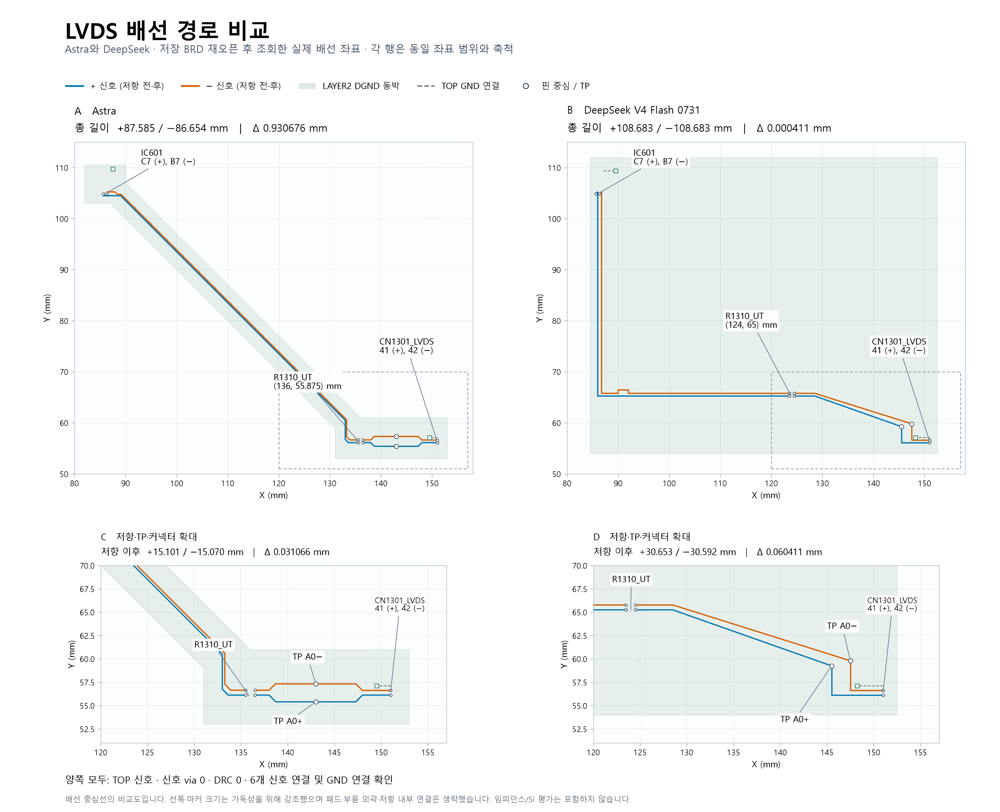

+++
title = 'Astra에게 LVDS 배치/배선을 시켜 봤습니다'
date = '2026-09-06T10:00:00+09:00'
draft = false
tags = ['OpenAI', 'Astra', 'DeepSeek', 'PCB', 'LVDS', 'Allegro', 'CAD', 'AI Agent', '자동화']
categories = ['AI', 'EDA']
description = 'Astra와 DeepSeek에게 같은 LVDS 배치·배선을 시켜 봤습니다 — Astra는 외부 계산 없이 좌표를 입력받아 GND 동박 좌표를 직접 출력했어요.'

[[resources]]
name = 'featured-image'
src = 'banner.png'

[[resources]]
name = 'featured-image-preview'
src = 'banner.png'
+++

## 들어가며

지난 글에서 Astra의 공간 이해를 직접 테스트해 보겠다고 했는데, 바로 해 봤어요. CubicAI Chat에서 Astra Agent와 DeepSeek V4 Flash Agent에게 같은 LVDS 한 쌍의 배치·배선을 시키고, 저장된 BRD를 다시 열어 좌표를 비교했습니다.

Astra가 여러 가지로 나은 결과를 보여줬지만, 그중에서도 인상적인 건 배선 밑의 GND Ref. 를 만든 모습이었습니다.

---

## 무엇을 시켰나

주요 IC와 커넥터의 위치, 연결할 핀, stackup, 배선 layer, 길이 차이 제한, 그리고 연속된 GND plane을 만들라는 요구를 지침으로 줬습니다. 저항과 TP의 위치, 배선 경유 좌표, GND 동박의 경계 좌표, GND via 위치는 모델이 정했어요. 지침에 배선 좌표나 동박 좌표는 없었습니다.

---

## 보이는 결과

둘 다 Cadence 내의 DRC 0으로 배선을 마쳤는데 구체적으로 설정된 상태는 아니었어요. Astra는 45° 대각선으로 짧게 갔는데, DeepSeek은 90° 코너를 끼고 20 mm쯤 더 돌아서 사람이 보기엔 좀 이상한 경로였습니다. 길이 매칭만은 DeepSeek이 더 정확했어요.

GND Ref. 는 그리는 방식이 달랐어요. DeepSeek은 배선 영역을 덮는 큰 사각형을 깔았고, Astra는 **배선을 따라 기울어진 띠**를 깔았어요. 사각형 폴리곤 도구로는 나올 수 없는 모양이라 어떻게 만든 건지 궁금했습니다.

---

## GND를 어떻게 그렸나?

실행 로그를 보니 Astra는 꼭짓점 10개의 좌표를 도구 인자로 직접 출력해서 한 번에 넘겼더라구요. Allegro 쪽 도구는 그 경계로 shape를 만들고 dynamic fill을 실행했을 뿐이에요.

Python 같은 도구를 불러 배선 형상을 Boolean 연산하거나 offset을 계산한 게 아닙니다. 로그 전체에서 외부 계산 실행이 없었어요. 이미지도 안 봤습니다. 핀 좌표, 배선 선분, 동박 경계 같은 텍스트 데이터만 받았고, 위의 figure는 실험이 끝난 뒤에 그 좌표로 그린 거예요.

좌표를 보면 배선 대각선이 x+y=193.5인데, GND 경계 두 선은 x+y=197과 x+y=190입니다. 배선 양쪽에 평행하게 띠를 두른 거죠.

---

## 제가 중요하게 보는 것

**LLM이 좌표를 입력받아, 공간적으로 추론하고, 좌표를 직접 출력했다**는 거예요. 계산은 코드가 하고 모델은 명령만 내리는 구조가 아니었습니다.

지금까지 CAD 자동화는 사람이 알고리즘을 짜고, 코드가 좌표를 계산하고, CAD가 형상을 만드는 순서였어요. 이번엔 가운데 계층 없이 모델이 형상을 만들었습니다. 누가 스크립트로 짜 둔 적 없는 형상을 그 자리에서 만든 거죠.

그래서 부품 배치와 주변 객체의 관계, 보드 안 공간 구성을 모델이 파악한다는 이야기가 데모가 아니라 제 손에서 확인된 셈이에요.

---

## 마무리

물론 배선 하나짜리 실험이고, 각도가 45°라 계산이 쉬웠을 수도 있어요. 복잡한 상황에서는 안되겠죠.

그래도 좌표 표만 보고 배선 아래에 리턴 패스를 깔았다는 건, 전편에서 기대했던 공간 이해가 실제 설계 도구 안에서 작동하기 시작했다는 뜻 같아요. 전역 구성은 사람도 한 번에 못 하니까, 블록 단위로 나눠 이 정도만 해 줘도 PCB/PKG 자동화에는 충분히 의미가 있지 않을까요.
