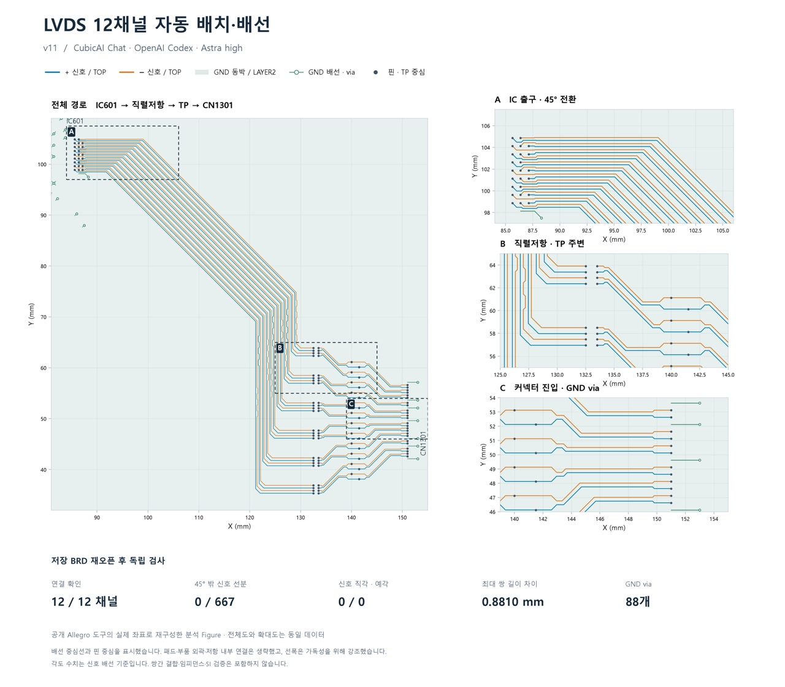

+++
title = '이번에는 Astra에게 LVDS 12채널을 배선시켜 봤습니다'
date = '2026-09-08T00:00:00+09:00'
draft = false
tags = ['OpenAI', 'Astra', 'CubicAI', 'PCB', 'LVDS', 'AI Agent']
categories = ['AI', 'EDA']
description = 'CubicAI에서 Astra에게 LVDS 12채널의 배치·배선을 맡기고, 지침을 조정하며 결과를 확인했습니다.'

[[resources]]
name = 'featured-image'
src = 'lvds-12-channel.jpg'

[[resources]]
name = 'featured-image-preview'
src = 'lvds-12-channel.jpg'
+++

[지난번에는 Astra에게 LVDS 한 쌍의 배치·배선을 시켜 봤습니다.](../260906-astra-lvds-gnd-shape-coordinates/) 이번에는 CubicAI에서 Astra를 이용해 12채널을 한꺼번에 맡겨 봤어요. 계속 테스트하고 있습니다.

처음에는 지난번보다 지침을 적게 주고 시작했습니다. 바로 원하는 결과가 나오지는 않았고, 우여곡절을 겪으며 지침을 조정한 끝에 그림과 같은 결과를 얻었어요.

저장한 BRD를 다시 열어 확인한 결과, 12채널 모두 연결돼 있었습니다. 신호 배선에는 직각·예각 코너가 없었고, 최대 쌍 길이 차이는 약 0.881 mm였어요. 임피던스나 SI 검증까지 진행한 결과는 아닙니다.

여러 채널의 경로와 부품 위치를 함께 고려해야 하는 작업인데, 이렇게 정리된 배선을 만들어 낸 점은 반가웠습니다.

물론 부분적으로 아쉬운 곳은 있어요. 이런 부분은 지침을 더 구체적으로 주면서 개선할 수 있을 것 같습니다. 어떤 조건을 미리 알려 줘야 하고, 어디까지 모델에게 맡겨도 되는지 확인하며 범위를 조금씩 넓혀 보려고 합니다.
